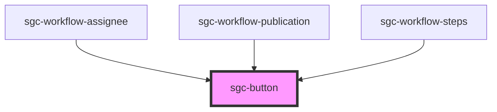

# sgc-button

<!-- Auto Generated Below -->

## Properties

| Property     | Attribute  | Description | Type                                                      | Default     |
| ------------ | ---------- | ----------- | --------------------------------------------------------- | ----------- |
| `color`      | `color`    |             | `"primary" \| "secondary" \| "tertiary"`                  | `'primary'` |
| `isActive`   | `active`   |             | `boolean`                                                 | `false`     |
| `isDisabled` | `disabled` |             | `boolean`                                                 | `false`     |
| `justify`    | `justify`  |             | `"center" \| "end" \| "start"`                            | `'center'`  |
| `variant`    | `variant`  |             | `"chip" \| "icon" \| "icon-round" \| "large" \| "normal"` | `'normal'`  |

## Events

| Event         | Description | Type                      |
| ------------- | ----------- | ------------------------- |
| `buttonClick` |             | `CustomEvent<MouseEvent>` |

## Shadow Parts

| Part       | Description |
| ---------- | ----------- |
| `"button"` |             |

## Dependencies

### Used by

 - [sgc-workflow-assignee](../sgc-workflow/sgc-workflow-assignee)
 - [sgc-workflow-publication](../sgc-workflow/sgc-workflow-publication)
 - [sgc-workflow-steps](../sgc-workflow/sgc-workflow-steps)

### Graph

----------------------------------------------

*Built with [StencilJS](https://stenciljs.com/)*
