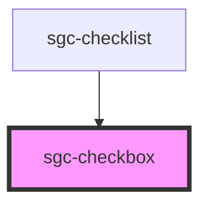

# sgc-checkbox

<!-- Auto Generated Below -->

## Properties

| Property             | Attribute       | Description | Type      | Default     |
| -------------------- | --------------- | ----------- | --------- | ----------- |
| `isDisabled`         | `disabled`      |             | `boolean` | `false`     |
| `isIndeterminate`    | `indeterminate` |             | `boolean` | `false`     |
| `value` _(required)_ | `value`         |             | `boolean` | `undefined` |

## Events

| Event            | Description | Type                   |
| ---------------- | ----------- | ---------------------- |
| `checkboxChange` |             | `CustomEvent<boolean>` |

## Dependencies

### Used by

 - [sgc-checklist](../sgc-checklist)

### Graph

----------------------------------------------

*Built with [StencilJS](https://stenciljs.com/)*
