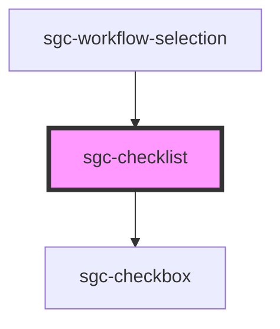

# sgc-checklist

<!-- Auto Generated Below -->

## Properties

| Property     | Attribute     | Description | Type      | Default     |
| ------------ | ------------- | ----------- | --------- | ----------- |
| `isDisabled` | `is-disabled` |             | `boolean` | `false`     |
| `value`      | `value`       |             | `boolean` | `undefined` |

## Events

| Event             | Description | Type                   |
| ----------------- | ----------- | ---------------------- |
| `checklistChange` |             | `CustomEvent<boolean>` |

## Dependencies

### Used by

 - [sgc-workflow-selection](../sgc-workflow/sgc-workflow-selection)

### Depends on

- [sgc-checkbox](../sgc-checkbox)

### Graph

----------------------------------------------

*Built with [StencilJS](https://stenciljs.com/)*
