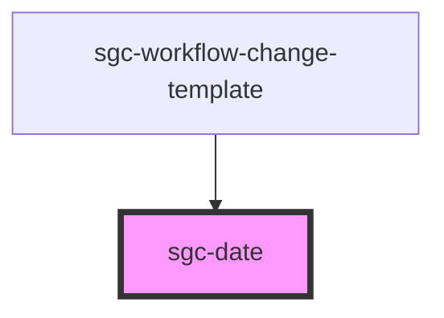

# sgc-date

<!-- Auto Generated Below -->

## Properties

| Property | Attribute | Description | Type                | Default     |
| -------- | --------- | ----------- | ------------------- | ----------- |
| `value`  | `value`   |             | `Date \| LocalDate` | `undefined` |

## Dependencies

### Used by

- [sgc-workflow-change-template](../sgc-workflow-change-template)

### Graph

---

_Built with [StencilJS](https://stenciljs.com/)_
