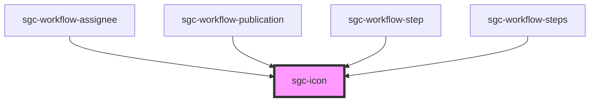

# sgc-icon

<!-- Auto Generated Below -->

## Properties

| Property | Attribute | Description | Type                                                                       | Default     |
| -------- | --------- | ----------- | -------------------------------------------------------------------------- | ----------- |
| `name`   | `name`    |             | `"assign" \| "checkmark" \| "chevronRight" \| "close" \| "edit" \| "plus"` | `undefined` |
| `size`   | `size`    |             | `"large" \| "normal"`                                                      | `'normal'`  |

## Dependencies

### Used by

- [sgc-workflow-assignee](../sgc-workflow/sgc-workflow-assignee)
- [sgc-workflow-publication](../sgc-workflow/sgc-workflow-publication)
- [sgc-workflow-step](../sgc-workflow/sgc-workflow-step)
- [sgc-workflow-steps](../sgc-workflow/sgc-workflow-steps)

### Graph

---

_Built with [StencilJS](https://stenciljs.com/)_
