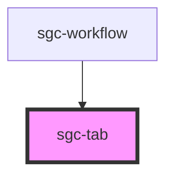

# sgc-tab

<!-- Auto Generated Below -->

## Properties

| Property   | Attribute   | Description | Type                    | Default |
| ---------- | ----------- | ----------- | ----------------------- | ------- |
| `isActive` | `is-active` |             | `boolean`               | `false` |
| `panel`    | `panel`     |             | `HTMLElement \| string` | `null`  |

## Dependencies

### Used by

- [sgc-workflow](../sgc-workflow)

### Graph

---

_Built with [StencilJS](https://stenciljs.com/)_
