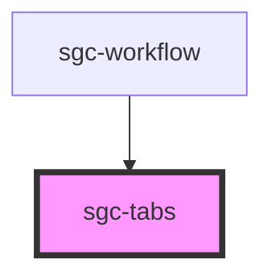

# sgc-tabs

<!-- Auto Generated Below -->

## Properties

| Property      | Attribute     | Description | Type                      | Default         |
| ------------- | ------------- | ----------- | ------------------------- | --------------- |
| `persistence` | `persistence` |             | `"hash" \| "memory-only"` | `'memory-only'` |

## Dependencies

### Used by

- [sgc-workflow](../sgc-workflow)

### Graph

---

_Built with [StencilJS](https://stenciljs.com/)_
