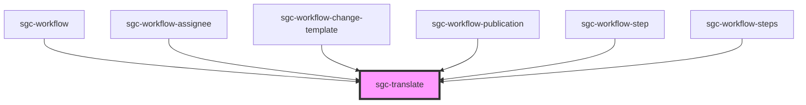

# sgc-translate

<!-- Auto Generated Below -->

## Properties

| Property          | Attribute | Description | Type         | Default     |
| ----------------- | --------- | ----------- | ------------ | ----------- |
| `ns` _(required)_ | `ns`      |             | `"workflow"` | `undefined` |

## Dependencies

### Used by

- [sgc-workflow](../sgc-workflow)
- [sgc-workflow-assignee](../sgc-workflow/sgc-workflow-assignee)
- [sgc-workflow-change-template](../sgc-workflow-change-template)
- [sgc-workflow-publication](../sgc-workflow/sgc-workflow-publication)
- [sgc-workflow-step](../sgc-workflow/sgc-workflow-step)
- [sgc-workflow-steps](../sgc-workflow/sgc-workflow-steps)

### Graph

---

_Built with [StencilJS](https://stenciljs.com/)_
