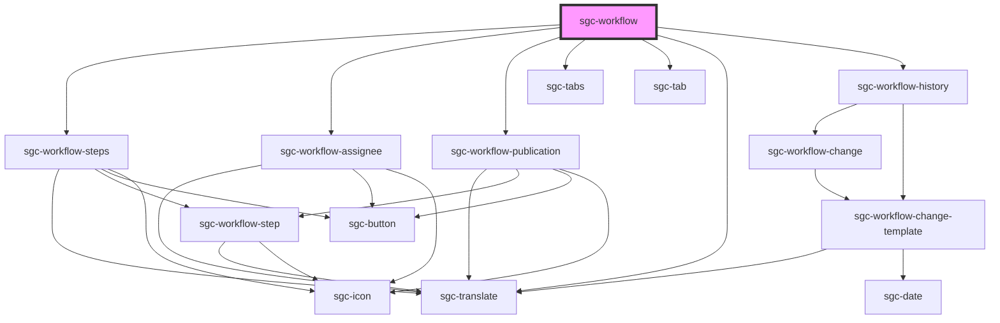

# sgc-workflow

<!-- Auto Generated Below -->

## Properties

| Property                  | Attribute      | Description | Type       | Default     |
| ------------------------- | -------------- | ----------- | ---------- | ----------- |
| `isReadOnly` _(required)_ | `is-read-only` |             | `boolean`  | `undefined` |
| `workflow` _(required)_   | `workflow`     |             | `Workflow` | `undefined` |

## Dependencies

### Depends on

- [sgc-workflow-steps](sgc-workflow-steps)
- [sgc-workflow-assignee](sgc-workflow-assignee)
- [sgc-workflow-publication](sgc-workflow-publication)
- [sgc-tabs](../sgc-tabs)
- [sgc-tab](../sgc-tab)
- [sgc-translate](../sgc-translate)
- [sgc-workflow-history](../sgc-workflow-history)

### Graph

---

_Built with [StencilJS](https://stenciljs.com/)_
