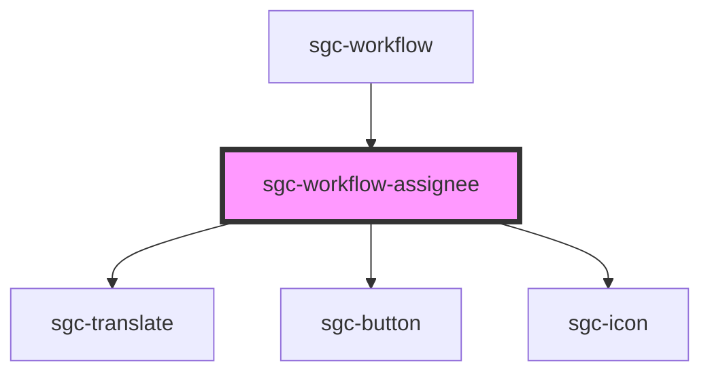

# sgc-workflow-assignee

<!-- Auto Generated Below -->

## Properties

| Property                | Attribute  | Description | Type       | Default     |
| ----------------------- | ---------- | ----------- | ---------- | ----------- |
| `workflow` _(required)_ | `workflow` |             | `Workflow` | `undefined` |

## Shadow Parts

| Part        | Description |
| ----------- | ----------- |
| `"heading"` |             |

## Dependencies

### Used by

 - [sgc-workflow](..)

### Depends on

- [sgc-translate](../../sgc-translate)
- [sgc-button](../../sgc-button)
- [sgc-icon](../../sgc-icon)

### Graph

----------------------------------------------

*Built with [StencilJS](https://stenciljs.com/)*
