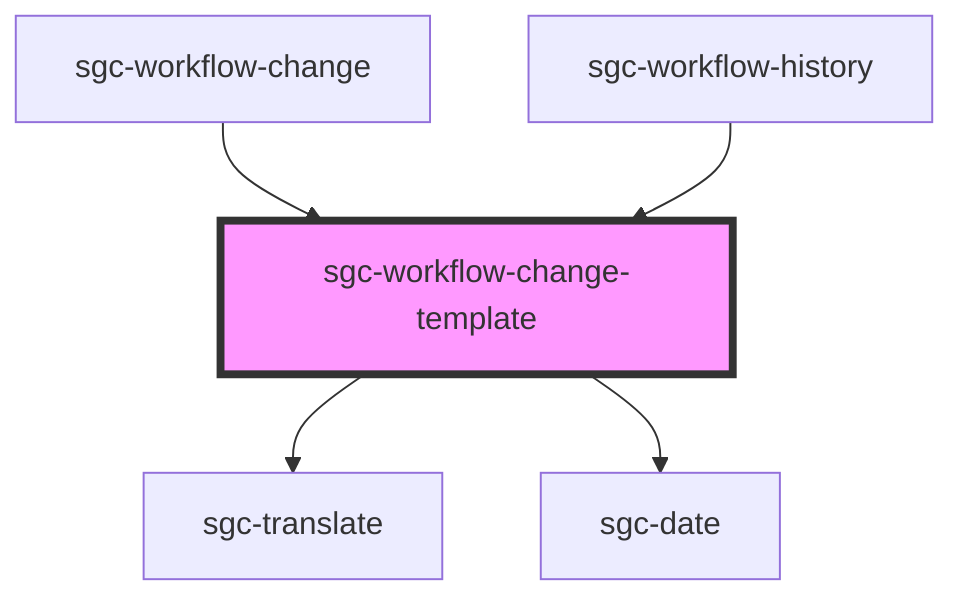

# sgc-workflow-change-template

<!-- Auto Generated Below -->

## Properties

| Property                 | Attribute    | Description | Type         | Default     |
| ------------------------ | ------------ | ----------- | ------------ | ----------- |
| `createdAt` _(required)_ | `created-at` |             | `LocalDate`  | `undefined` |
| `creator` _(required)_   | `creator`    |             | `SimpleUser` | `undefined` |

## Dependencies

### Used by

- [sgc-workflow-change](../sgc-workflow-change)
- [sgc-workflow-history](../sgc-workflow-history)

### Depends on

- [sgc-translate](../sgc-translate)
- [sgc-date](../sgc-date)

### Graph

---

_Built with [StencilJS](https://stenciljs.com/)_
