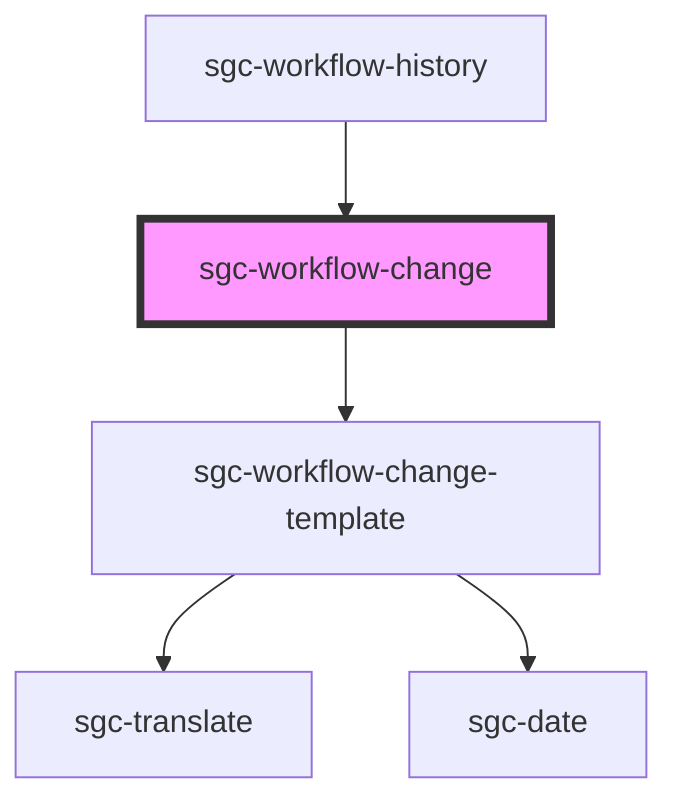

# sgc-workflow-change

<!-- Auto Generated Below -->

## Properties

| Property                | Attribute  | Description | Type             | Default     |
| ----------------------- | ---------- | ----------- | ---------------- | ----------- |
| `change` _(required)_   | `change`   |             | `WorkflowChange` | `undefined` |
| `workflow` _(required)_ | `workflow` |             | `Workflow`       | `undefined` |

## Dependencies

### Used by

 - [sgc-workflow-history](../sgc-workflow-history)

### Depends on

- [sgc-workflow-change-template](../sgc-workflow-change-template)

### Graph

----------------------------------------------

*Built with [StencilJS](https://stenciljs.com/)*
