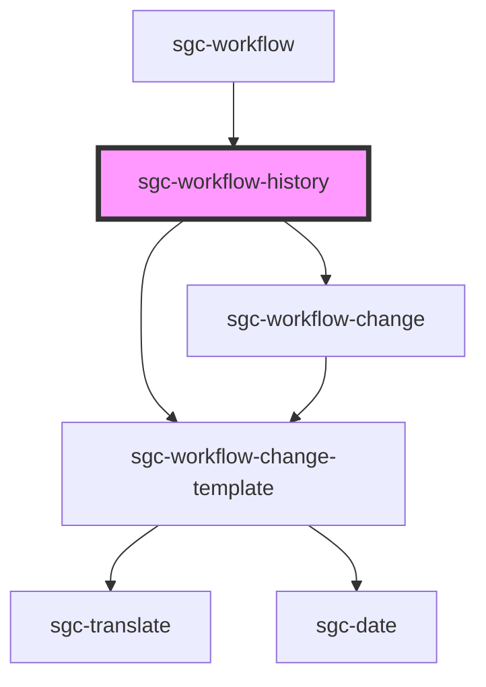

# sgc-workflow-history

<!-- Auto Generated Below -->

## Properties

| Property                | Attribute  | Description | Type       | Default     |
| ----------------------- | ---------- | ----------- | ---------- | ----------- |
| `workflow` _(required)_ | `workflow` |             | `Workflow` | `undefined` |

## Dependencies

### Used by

- [sgc-workflow](../sgc-workflow)

### Depends on

- [sgc-workflow-change](../sgc-workflow-change)
- [sgc-workflow-change-template](../sgc-workflow-change-template)

### Graph

---

_Built with [StencilJS](https://stenciljs.com/)_
