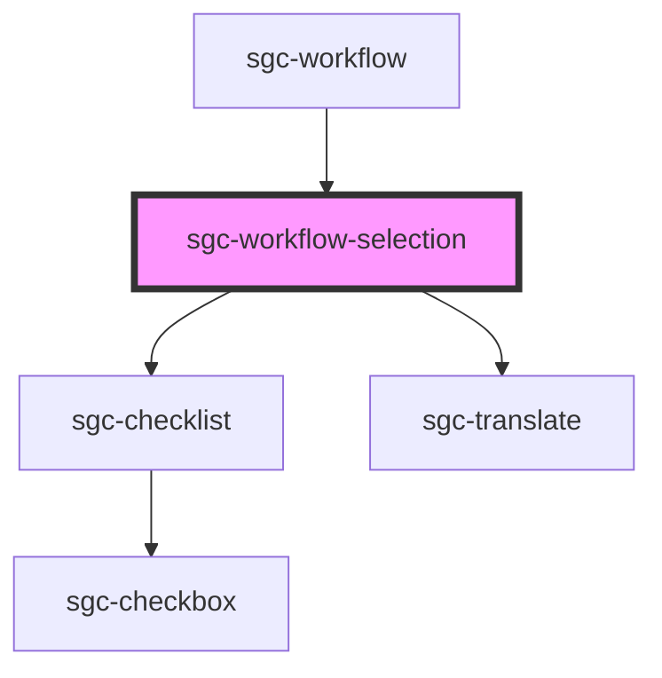

# sgc-workflow-selection

<!-- Auto Generated Below -->

## Properties

| Property                  | Attribute      | Description | Type                     | Default     |
| ------------------------- | -------------- | ----------- | ------------------------ | ----------- |
| `isReadOnly` _(required)_ | `is-read-only` |             | `boolean`                | `undefined` |
| `selection` _(required)_  | `selection`    |             | `"approval" \| "review"` | `undefined` |
| `workflow` _(required)_   | `workflow`     |             | `Workflow`               | `undefined` |

## Events

| Event                    | Description | Type                                                  |
| ------------------------ | ----------- | ----------------------------------------------------- |
| `workflowApprovalChange` |             | `CustomEvent<SgcWorkflowSelectionChangeEventDetails>` |
| `workflowReviewChange`   |             | `CustomEvent<SgcWorkflowSelectionChangeEventDetails>` |

## Dependencies

### Used by

- [sgc-workflow](..)

### Depends on

- [sgc-checklist](../../sgc-checklist)
- [sgc-translate](../../sgc-translate)

### Graph

---

_Built with [StencilJS](https://stenciljs.com/)_
