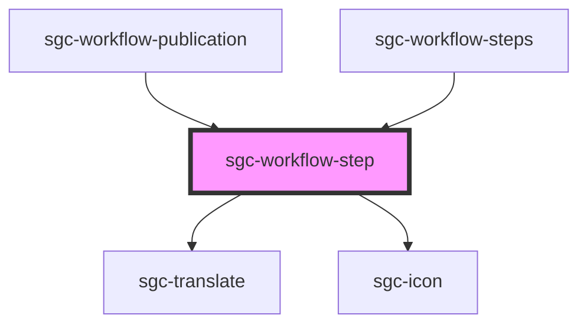

# sgc-workflow-step

<!-- Auto Generated Below -->

## Properties

| Property                | Attribute  | Description | Type                                                                                                     | Default     |
| ----------------------- | ---------- | ----------- | -------------------------------------------------------------------------------------------------------- | ----------- |
| `status` _(required)_   | `status`   |             | `WorkflowStatus.Draft \| WorkflowStatus.InReview \| WorkflowStatus.Published \| WorkflowStatus.Reviewed` | `undefined` |
| `workflow` _(required)_ | `workflow` |             | `Workflow`                                                                                               | `undefined` |

## Dependencies

### Used by

 - [sgc-workflow-publication](../sgc-workflow-publication)
 - [sgc-workflow-steps](../sgc-workflow-steps)

### Depends on

- [sgc-translate](../../sgc-translate)
- [sgc-icon](../../sgc-icon)

### Graph

----------------------------------------------

*Built with [StencilJS](https://stenciljs.com/)*
