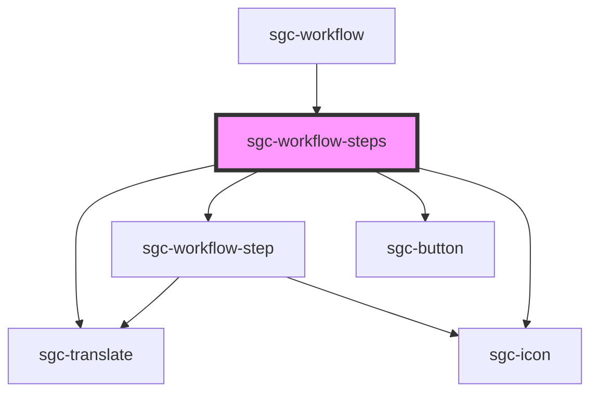

# sgc-workflow-steps

<!-- Auto Generated Below -->

## Properties

| Property                  | Attribute      | Description | Type       | Default     |
| ------------------------- | -------------- | ----------- | ---------- | ----------- |
| `isReadOnly` _(required)_ | `is-read-only` |             | `boolean`  | `undefined` |
| `workflow` _(required)_   | `workflow`     |             | `Workflow` | `undefined` |

## Shadow Parts

| Part        | Description |
| ----------- | ----------- |
| `"heading"` |             |

## Dependencies

### Used by

 - [sgc-workflow](..)

### Depends on

- [sgc-translate](../../sgc-translate)
- [sgc-workflow-step](../sgc-workflow-step)
- [sgc-button](../../sgc-button)
- [sgc-icon](../../sgc-icon)

### Graph

----------------------------------------------

*Built with [StencilJS](https://stenciljs.com/)*
